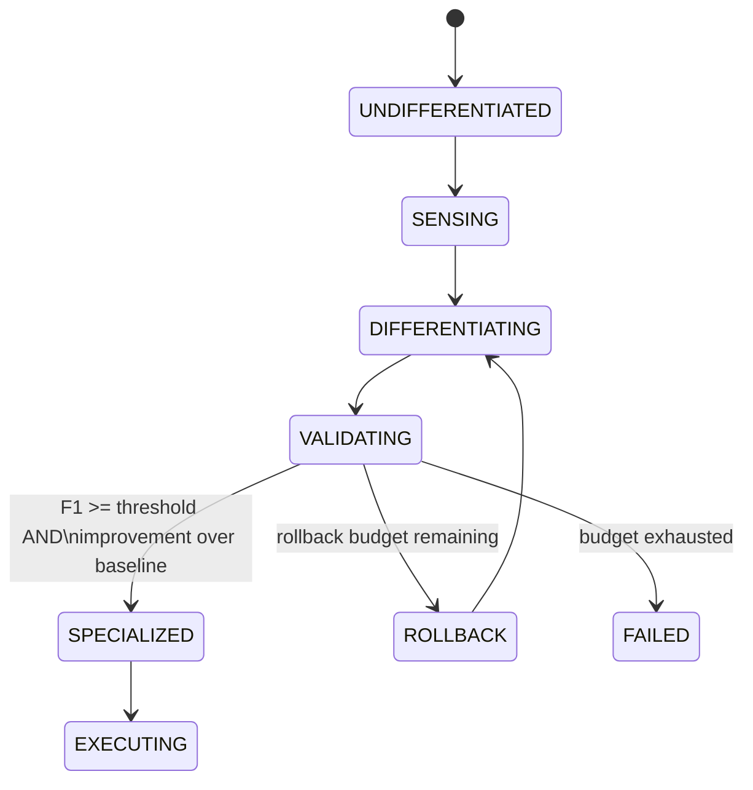
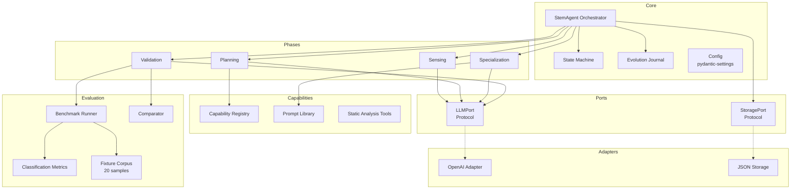

# Stem Agent: A Self-Specializing AI Agent for Code Quality Analysis

## 1. Problem & Approach

**Problem.** General-purpose LLMs produce unfocused code reviews: they hallucinate issues in correct code, miss subtle bugs, and lack systematic evaluation against ground truth. The task is to build an agent that *specializes itself* for code quality analysis — starting undifferentiated and ending as a measurably better reviewer, with rollback if specialization fails.

**Approach.** I modeled the agent lifecycle as a biological differentiation process. A stem agent begins undifferentiated, senses its domain through an LLM, plans a multi-pass review architecture, assembles a specialized prompt from composable fragments, validates performance against a 20-sample benchmark corpus, and either graduates to SPECIALIZED or rolls back with diagnostic adjustments. A state machine with guard predicates enforces that transitions only happen when quantitative criteria are met — this is not decorative.

**Architecture choice: Hexagonal (Ports & Adapters).** The core logic depends on protocols (`LLMPort`, `StoragePort`), not concrete implementations. This is critical for two reasons: (1) the test suite runs 113 tests in under a second using a `FakeLLM` that never touches a network, and (2) swapping from OpenAI to any other provider requires implementing two methods — no core changes.

## 2. Architecture

### Component Diagram

### Key Design Decisions

| Decision | Rationale |
|---|---|
| **Protocol over ABC** | Structural subtyping: any object with matching methods satisfies the contract. `FakeLLM` needs no inheritance — just `generate()` and `structured_generate()`. |
| **Guard predicates on state transitions** | Not decorative. `VALIDATING → SPECIALIZED` requires F1 >= threshold AND improvement over baseline. These are evaluated at runtime with context data. |
| **Append-only evolution journal** | Every decision, metric, LLM call, and state transition is recorded with timestamps. This is the agent's self-model — its memory of how it became what it is. |
| **Composable prompt fragments** | The system prompt is assembled at specialization time from fragments mapped to capabilities. Rollback adjustments are injected as extra guidance without rewriting the base. |
| **Category normalization** | LLMs produce varied category names ("sql_injection", "vulnerability", "security_vulnerability"). A normalization layer maps all variants to 4 canonical categories. |
| **FakeLLM as first-class test double** | Not a mock — a deterministic response engine with substring-matched routing and call tracking. It models realistic LLM behavior for all 20 benchmark samples. |
| **Deterministic cross-check after validation** | Every specialized verdict is replayed through AST-based `analyze_structure` and regex-based `scan_patterns`. Disagreements land in the journal as `DECISION` events, so over-flags and misses are visible instead of hidden. |
| **Prompt diff across rollback** | When specialization runs twice, the orchestrator renders a coloured unified diff between the before- and after-prompts and logs a one-line summary. Rollback stops being a black box. |
| **Retry + timeout at the adapter boundary** | Four-attempt exponential backoff (1s→8s) on `RateLimitError`, `APITimeoutError`, `APIConnectionError`, plus a configurable `request_timeout`. Core and phase code stay ignorant of the network. |

### State Machine Detail

The state machine enforces 8 transitions between 8 states. Three transitions are guarded:

- **VALIDATING → SPECIALIZED**: `f1_above_threshold` (F1 >= 0.6) AND `improvement_over_baseline` (specialized F1 > baseline F1)
- **VALIDATING → ROLLBACK**: `rollback_budget_remaining` (attempts < max, default 3)
- **VALIDATING → FAILED**: Unguarded fallback when rollback budget is exhausted

Guard failures are logged to the journal with the guard name, transition, and reason string. This creates a traceable audit trail for why the agent could not graduate.

### Differentiation Lifecycle

1. **Sensing**: Queries the LLM with a domain signal ("code_quality_analysis") to build structured `DomainKnowledge` — review strategies, issue taxonomy, tool categories, key insights.
2. **Planning**: Selects capabilities from the registry, designs a multi-pass review pipeline (structural → logic → security → performance → severity), and validates that all capability names actually exist (hallucinated names are logged and dropped).
3. **Specialization**: Assembles the system prompt from `BASE_REVIEW_PROMPT` + domain insights + capability fragments + output format specification. On rollback, adjustments from `diagnose_failure()` are injected as additional guidance.
4. **Validation**: Runs both the undifferentiated baseline and the specialized agent against the full 20-sample benchmark corpus. Computes precision, recall, F1, and specificity for each. The `ComparisonResult` computes deltas. Guard predicates decide the next transition. After scoring, every specialized verdict is replayed through the deterministic AST and pattern scanners — disagreements are logged as `DECISION` events so cross-check findings are auditable alongside metrics.

The pipeline is not wired to a single domain. An eight-sample security-audit corpus lives alongside the main one, and an integration test differentiates against both: the security specialisation ends up with a strictly narrower capability set and visibly security-flavoured prompt language, proving the architecture generalises beyond the `code_quality_analysis` label.

## 3. Evaluation & QA Strategy

### Benchmark Corpus

The 20-sample corpus is designed to stress-test the agent across realistic scenarios:

| Category | Count | Examples |
|---|---|---|
| Logic bugs | 5 | Off-by-one in binary search, wrong comparison operator, missing null check, integer overflow, boundary error |
| Security vulnerabilities | 4 | SQL injection via f-string, path traversal, hardcoded credentials, eval() with user input |
| Code smells | 4 | Deep nesting, god function, dead code after return, long parameter list |
| Performance issues | 2 | N+1 queries in loop, unnecessary deep copy |
| Clean code (adversarial) | 5 | Intentionally suspicious-looking but correct code — tests false positive resistance |

The clean samples are the hardest. They include patterns that look like bugs to a naive reviewer (e.g., a function that uses `eval()` safely with `__builtins__={}`, or a comparison that looks off-by-one but is correct for the domain). This is where the F1 score matters: precision without recall is useless, and recall without precision floods developers with noise.

### Metrics

Evaluation uses category-level classification metrics:

- **True positive**: Detected category exists in ground truth
- **False positive**: Detected category does not exist in ground truth (or any detection on clean code)
- **False negative**: Ground truth category not detected
- **True negative**: Clean sample correctly identified as clean

All metric properties handle division by zero (returning 0.0) — tested explicitly with all-zeros input.

### Rollback Diagnosis

When validation fails, `diagnose_failure()` analyzes *what specifically went wrong*:
- Precision dropped → "Reduce false positive rate"
- Recall dropped → "Improve issue detection thoroughness"
- Specificity dropped → "Improve clean code recognition"
- F1 did not improve → "Simplify prompt to reduce confusion"

These adjustments feed back into the next specialization attempt as extra prompt guidance.

### Test Suite

113 tests, organized by concern:

| Module | Tests | What it covers |
|---|---|---|
| `test_state_machine.py` | 26 | Valid/invalid transitions, guard predicates, rollback budget, reset, state accessors |
| `test_state_machine_properties.py` | 5 | Hypothesis property tests — invariants over random transition sequences |
| `test_journal.py` | 18 | Append-only semantics, serialization round-trip, LLM call metadata, token totals, filtering |
| `test_metrics.py` | 15 | Perfect detection, zero detection, all false positives, all zeros, balanced F1, `compute_metrics` aggregation |
| `test_phases.py` | 26 | Each phase in isolation: sensing/planning/specialization/validation, plus `diagnose_failure` and AST cross-check |
| `test_openai_adapter.py` | 6 | Retry on transient errors, exhaustion, non-retryable propagation, timeout wiring |
| `test_integration.py` | 17 | Full pipeline, rollback mechanism, prompt diff logging, journal persistence, multi-domain specialization |

**Test philosophy**: `FakeLLM` is a first-class test double with realistic canned responses for all 20 benchmark samples. Tests run in under a second with zero network calls. The `poor_fake_llm` fixture returns deliberately degraded responses to trigger rollback — testing the failure path as rigorously as the happy path. Hypothesis property tests on the state machine search two hundred random transition sequences per property for counter-examples to invariants I care about (monotonic rollback count, FAILED-is-terminal, etc.), so the proof is not limited to the cases I happened to imagine.

### 3.5 Results from a Live Run

A real run against the OpenAI API (captured in `docs/example_run/journal.json`):

| | Baseline (undifferentiated) | Specialized | Δ |
|---|---:|---:|---:|
| Precision | 0.000 | 0.667 | +0.667 |
| Recall | 0.000 | 0.933 | +0.933 |
| F1 | 0.000 | 0.778 | +0.778 |
| Specificity | 0.000 | 0.300 | +0.300 |

Forty-two LLM calls (gpt-4o-mini for sensing/planning/baseline, gpt-4o for the specialized pass), forty-one thousand total tokens, no rollbacks, roughly twenty cents at current OpenAI pricing. The baseline zero is honest rather than flattering — the undifferentiated prompt does not ask for structured JSON, so the parser returns no categories on every sample. That is exactly the gap the pipeline exists to close. The cross-check layer also fired on this run, flagging two over-flags on structure and one `eval()` call the LLM missed, all logged as `DECISION` events.

## 4. Trade-offs & Extensions

### Trade-offs Made

**Single-LLM evaluation.** Both baseline and specialized agents use the same LLM (via different prompts). This is a fair A/B test of prompt engineering effectiveness, but does not test whether a weaker model + better prompt can match a stronger model. A production system would cross-evaluate models.

**Static benchmark corpus.** The 20 samples are handcrafted fixtures. This makes tests deterministic and fast, but the corpus may not capture the full distribution of real-world code. Extension: generate additional samples programmatically or pull from open-source repositories with known CVEs.

**Synchronous execution.** Each benchmark sample is reviewed sequentially. For a 20-sample corpus this is acceptable, but scaling to hundreds of samples would benefit from async execution with rate limiting.

**Category granularity.** The normalization layer maps to 4 canonical categories (logic, security, structure, performance). Some issues span categories (e.g., a security bug caused by a logic error). The current model counts this as TP for the detected category and ignores cross-category relationships.

### What I Would Add Next

1. **Async benchmark runner.** Replace the synchronous loop in `run_benchmark` with `asyncio.gather()` and semaphore-based rate limiting. The architecture already supports this — `ReviewFunction` would become `AsyncReviewFunction`.

2. **Multi-model evaluation.** The `LLMPort` protocol already supports model overrides. Wire the validation phase to test the same prompt against multiple models and select the best model-prompt pair, not just the best prompt.

3. **Continuous corpus expansion.** Add a feedback loop: when the specialized agent reviews real code and a human corrects the review, the correction becomes a new benchmark sample. The corpus grows with production usage.

4. **Capability discovery.** Currently capabilities are predefined in the registry. An extension would let the planning phase *propose* new capabilities that don't exist yet, and have the specialization phase generate their prompt fragments dynamically.

5. **Token-budget guard.** The journal already totals tokens per run; an obvious next step is a state-machine guard that rolls back or fails if a run would exceed a configured budget, matching the F1 and improvement guards in spirit.
