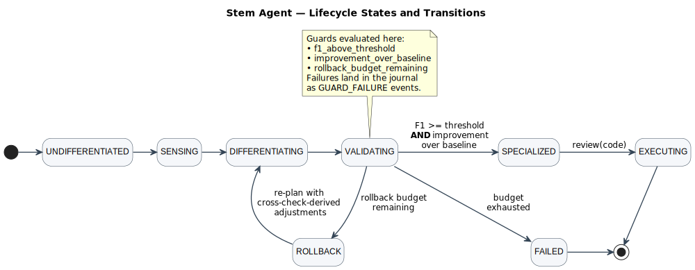

# Stem Agent: A Self-Specializing AI Agent for Code Quality Analysis

## 1. Problem & Approach

**Problem.** General-purpose LLMs produce unfocused code reviews: they hallucinate issues in correct code, miss subtle bugs, and lack systematic evaluation against ground truth. The task is to build an agent that *specializes itself* for code quality analysis — starting undifferentiated and ending as a measurably better reviewer, with rollback if specialization fails.

**Approach.** A stem agent begins undifferentiated, senses its domain through an LLM, proposes and sandboxes a new capability, plans a multi-pass review, assembles a specialized prompt from composable fragments, validates against a 20-sample benchmark, and either graduates to `SPECIALIZED` or rolls back with diagnostic adjustments. A state machine with guard predicates enforces that transitions only happen when quantitative criteria are met.

**Architecture: Hexagonal (Ports & Adapters).** Core logic depends on `LLMPort` and `StoragePort` protocols, not concrete implementations. This is not decorative: the 142-test suite runs in under a second using a `FakeLLM` that never touches a network, and swapping providers is two method implementations.

## 2. Architecture

### Key Design Decisions

| Decision | Rationale |
|---|---|
| **Protocol over ABC** | Structural subtyping: `FakeLLM` needs no inheritance — just `generate()` and `structured_generate()`. |
| **Guarded state transitions** | `VALIDATING → SPECIALIZED` requires F1 >= threshold AND improvement over baseline. Guard reasons land in the journal. |
| **Append-only evolution journal** | Every decision, metric, LLM call, and transition is recorded. The agent's memory of how it became what it is. |
| **Composable prompt fragments** | Prompts are assembled at specialization time. Rollback adjustments are injected as extra guidance without rewriting the base. |
| **Sandboxed capability generation** | LLM-proposed Python runs in a Python-isolated-mode subprocess with `RLIMIT_CPU` and a wall-clock timeout, gated by an allowlist AST scan that forbids `open`, `os`, `subprocess`, `__import__`. Two independent layers, no external dependency — defensible over `RestrictedPython`. |
| **Static tools in the review prompt** | `analyze_structure` (AST) and `scan_patterns` (regex) run on the input before every specialized review, and their findings are injected as a `## Static Tool Findings` block. The baseline stays untooled so the A/B is honest about what specialization contributes. |
| **Cross-check → rollback adjustments** | Every specialized verdict is replayed through the deterministic checks. Disagreements become targeted prompt fixes on the next attempt: `N` structure over-flags turn into "be conservative on short functions"; `N` scanner-caught security misses turn into "scan harder for eval/hardcoded credentials". |
| **Prompt diff across rollback** | When specialization runs twice, a coloured unified diff is rendered and a one-line summary logged. Rollback stops being a black box. |
| **Retry + timeout at the adapter** | Exponential backoff on transient OpenAI errors and a configurable `request_timeout`. Core and phase code stay ignorant of the network. |

The pipeline is not wired to a single domain. An eight-sample security-audit corpus lives alongside the main one, and an integration test differentiates against both: the security specialisation ends up with a strictly narrower capability set and visibly security-flavoured prompt language.

## 3. Evaluation & QA Strategy

### Benchmark Corpus

| Category | Count | Examples |
|---|---|---|
| Logic bugs | 5 | Off-by-one in binary search, wrong comparison operator, missing null check |
| Security | 4 | SQL injection via f-string, path traversal, hardcoded credentials, `eval()` on user input |
| Code smells | 4 | Deep nesting, god function, dead code after return, long parameter list |
| Performance | 2 | N+1 queries, unnecessary deep copy |
| Clean (adversarial) | 5 | Intentionally suspicious-looking but correct code — tests false-positive resistance |

The clean samples are the hardest: they include code that uses `eval()` safely with `__builtins__={}`, or a comparison that looks off-by-one but is correct for the domain. Precision without recall is useless; recall without precision floods developers with noise — F1 is what matters.

### Rollback Diagnosis — a Closed Feedback Loop

When validation fails, `diagnose_failure()` reads two signals: the benchmark comparison (precision/recall/specificity/F1 deltas produce generic nudges) and the cross-check disagreements the validation phase already collected. The cross-check is what makes this a real feedback loop rather than a score gate: `N` samples where the LLM flagged structure on short, shallow code become "do not flag structure unless a function exceeds ~20 lines or depth exceeds 2"; `N` samples where the pattern scanner caught `eval()` / hardcoded credentials / SQL concat / `pickle.loads` that the LLM missed become "scan harder for …" with the exact patterns named.

Every step of the loop is visible in the journal: the disagreement lands as a `DECISION`, the derived adjustment as a `ROLLBACK_REASON`, and the re-composed prompt's delta as a coloured-diff summary — also a `DECISION`. The next attempt is shaped by where the last one actually went wrong, not just by how far its F1 fell short.

### Test Suite

142 tests, under a second, zero network. Hypothesis property tests search 200 random transition sequences per invariant (rollback monotonicity, `FAILED`-is-terminal). `FakeLLM` is a first-class test double with canned responses for all 20 samples; `poor_fake_llm` returns deliberately degraded answers to exercise the failure path as rigorously as the happy path.

### 3.5 Results from a Live Run

A real run against the OpenAI API (captured in `docs/example_run/journal.json`):

| | Baseline | Specialized | Δ |
|---|---:|---:|---:|
| Precision | 0.000 | 0.667 | +0.667 |
| Recall | 0.000 | 0.933 | +0.933 |
| F1 | 0.000 | 0.778 | +0.778 |
| Specificity | 0.000 | 0.300 | +0.300 |

Forty-two LLM calls (gpt-4o-mini for sensing/planning/baseline, gpt-4o for the specialized pass), forty-one thousand total tokens, no rollbacks, roughly twenty cents. The cross-check fired on this run too, flagging two structure over-flags and one `eval()` the LLM missed — all logged as `DECISION` events.

### 3.6 What surprised me, what failed

**The baseline F1 of 0.00 is a parser artefact, not a triumph.** The undifferentiated prompt never asks for structured JSON, so the parser returns no categories on every sample. Part of the specialization delta is bought by asking for JSON at all, not by deeper reasoning. I considered nudging the baseline toward JSON to make the comparison "fairer," but the honest framing is that output-structure discipline is part of what specialization wins, and the numbers should say so.

**Cross-check disagreements started life as a score input.** The first design penalized F1 when the LLM disagreed with the AST or the pattern scanner. That made validation stricter but taught the next attempt nothing. Feeding the disagreements back as prompt guidance is what actually closes the loop. That reframing took the longest.

**FakeLLM substring routing is brittle.** When I drifted a prompt phrase during development the test double silently stopped matching, integration tests flipped to the default clean response, and the failure looked like a regression in the specialized agent. Renaming a prompt now means re-auditing the keys in `conftest.py`.

**Capability generation nearly didn't ship.** Until late, the agent only selected from a fixed registry — a composer, not a stem cell. Admitting that, and adding the sandboxed generation phase, was the last meaningful change and the one that made the metaphor honest.

## 4. Trade-offs & Extensions

**Single-LLM evaluation.** Both baseline and specialized agents use the same LLM family. This is a fair A/B of prompt engineering, but does not test whether a weaker model with a better prompt can match a stronger one.

**Static benchmark corpus.** Twenty handcrafted samples keep tests deterministic and fast but can't capture the full distribution of real-world code.

**Synchronous execution.** Acceptable at 20 samples; scaling to hundreds would want `asyncio.gather()` with a rate-limiting semaphore. `ReviewFunction` would become `AsyncReviewFunction` — the architecture already supports this.

**Would add next.** (1) *Multi-model evaluation* — the `LLMPort` already supports overrides; wire validation to pick the best model-prompt pair, not just the best prompt. (2) *Token-budget guard* — the journal already totals tokens; a state-machine guard that rolls back or fails on budget overrun would match the F1 and improvement guards in spirit.
